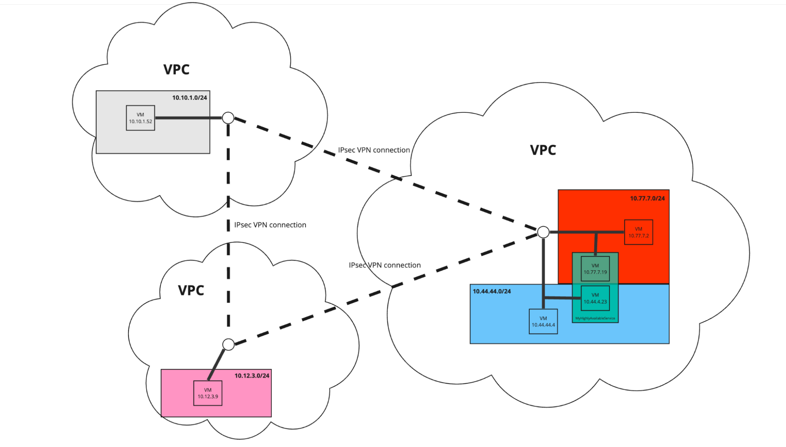
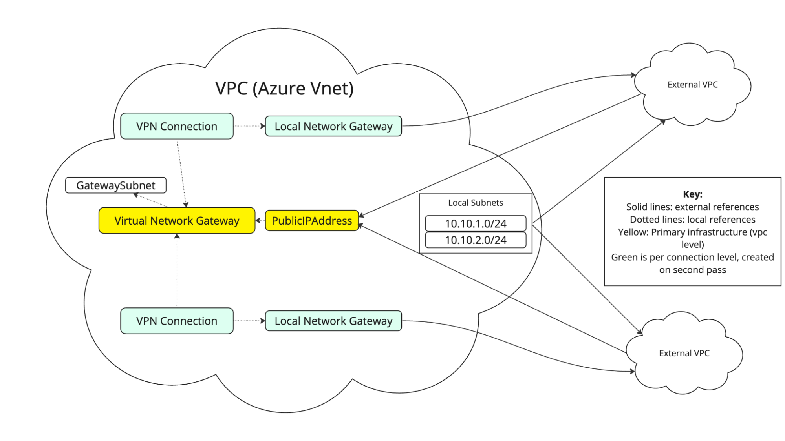
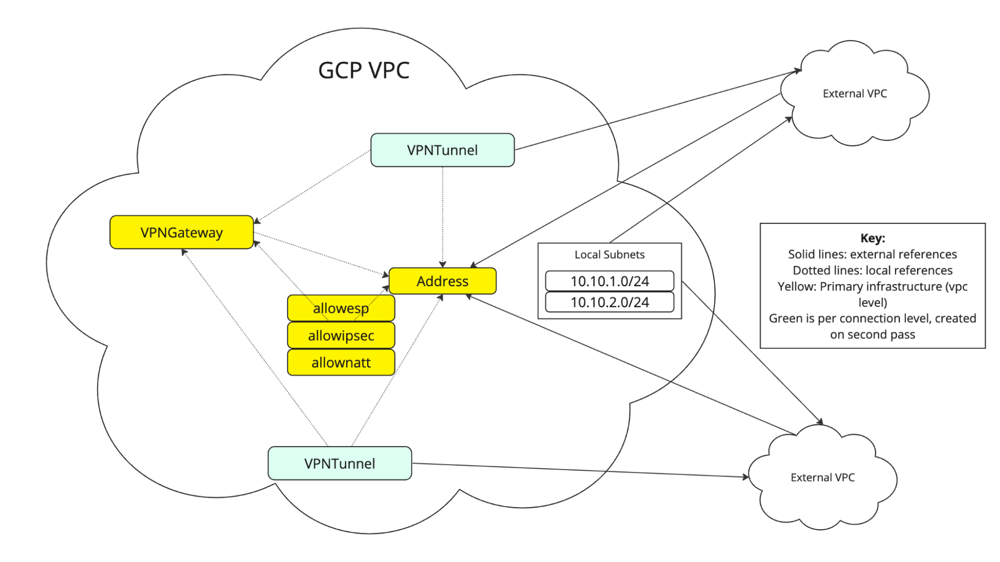
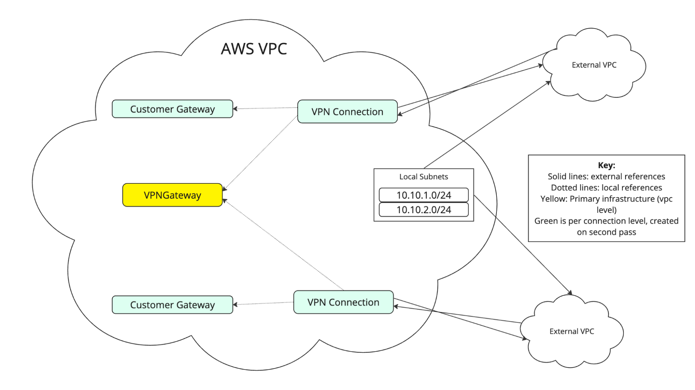

# Chasm

[](https://npmjs.org/package/@isopod/chasm)
[](https://hub.docker.com/r/isopod/chasm/)
[](https://github.com/facebook/jest)

[IPsec]: https://en.wikipedia.org/wiki/IPsec

## Description

Chasms are what many businesses run into when trying to find the skill-sets and knowledge to navigate between the different cloud provider's environments.  This can include APIs, tools, languages, networking architectures, and even having visibility into what subnets you might have in each cloud environment.  When what you really want is to be able to get your data from one place to the another that you need... crossing that chasm.

The process of creating [IPsec] tunnels between [virtual private clouds](https://en.wikipedia.org/wiki/Virtual_private_cloud) (VPCs) is different in each Cloud Service Provider (CSP), and it can be difficult to automate due to how IP addressing is handled (particularly for inter-cloud connectivity), eventual consistency in the standard CSPs APIs, and some dizzying circular dependencies to navigate through.

Enter Chasm, a tool for bridging the gaps between the clouds for you.

### Core functions

- Report all your VPCs and subnets from your CSPs.
- Create a mesh [IPsec] network out of the cloud subnets you select from these CSPs.

### Network designs supported

- **Inter-cloud meshing**: meshing subnets between two or more distinct clouds i.e. AWS and GCP.

- **Mix of inter and intra-cloud Meshing**: meshing subnets between two or more distinct clouds, and more than one subnet within same CSP, where same CSP is under a single account.

### Known limitations

**No NAT**: There is no built in NAT, meaning we can't mesh subnets with overlapping CIDRS.

- **Multi-account, single cloud meshing**: We currently do not support situations where you have more than one account associated to a single CSP and want to mesh two or more subnets that are in different CSP accounts (i.e. if you have two AWS accounts with a subnet in account A, and a subnet in account B, these tools do not currently support connectivity between them).

- **Azure cross-subscription meshing**: You cannot connect two or more Azure subnets across Azure subscriptions.

- **AWS cross-region meshing**: You cannot connect two or more AWS subnets across AWS regions.

- **GCP cross-project meshing**: You cannot mesh together two VPCs across GCP projects.

### Supported clouds

- [Amazon Web Services (AWS)](https://aws.amazon.com/)
- [Google Cloud Platform (GCP)](https://console.cloud.google.com/)
- [Microsoft Azure Cloud Platform](https://azure.microsoft.com/)

## Quick start

This quickstart will walk you through the process of creating a simple Chasm-powered network: installation, defining the mesh network subnets, deploying the network, and then how to tear it down.

### npm

Instructions for the `npm` quickstart are provided [here](docs/npm-quickstart.md). Docker may be preferred as you do not need to install pulumi.

### Docker

The following instructions are for the [docker](https://www.docker.com/) quickstart. The latest image should be downloaded with:

```sh
docker pull isopod/chasm:main
```

_Don't have docker installed? Install Docker Desktop On [Mac](https://docs.docker.com/desktop/install/mac-install/), [Windows](https://docs.docker.com/desktop/install/windows-install/), or [Linux](https://docs.docker.com/desktop/install/linux-install/)._

### Windows users only - WSL docker quickstart

**Windows users should use docker from inside WSL. Follow these quick steps if you use windows.**

1. install a distro:

    ```sh
    wsl --install -d Ubuntu
    ```

2. Ensure the WSL version is 2

    ```sh
    wsl --set-version 2 Ubuntu
    ```

3. Set to default disto

    ```sh
    wsl --set-default Ubuntu
    ```

4. In Docker Desktop, go to Resources, WSL Integration and make sure the checkbox for Enable Integration with my default WSL distro is checked.

5. Open an Ubuntu WSL prompt (Windows Key+R, then enter WSL, then click Run). Do everything from here like you're on Linux.

More resources if you get stuck: How to use [Docker Desktop in WSL](https://docs.docker.com/desktop/wsl/), How to [install WSL](https://learn.microsoft.com/en-us/windows/wsl/install)

### Installing and configuring cloud CLIs

Before proceeding, follow [the guide for installing and configuring cloud CLIs](docs/installing-cloud-clis.md).

## Usage

**Windows users MUST follow these steps from a WSL2 terminal in the distribution they run Docker from. [Link to install WSL](https://learn.microsoft.com/en-us/windows/wsl/install)**

Quick overview of what will be done in the quickstart (more in depth instruction in the following section):

1. In `./mount/config.json`, define the Cloud Accounts that will be used to look up Subnets
2. Run the `find` command to list all the subnets that can be meshed
3. In `./mount/config.json`, edit the list of discovered subnets until it contains only the subnets you want to mesh
4. Run the `mesh` command to mesh those subnets

### Initializing a project directory

First, make a project directory, a mount folder, and change directories into the project folder

```sh
mkdir -p chasm/mount/pulumi
mkdir -p chasm/mount/stackWorkDir
cd chasm
```

### Config file

The config file determines:

1. Which clouds are scraped for subnets (from the "accounts" field)
2. Which subnets are meshed together (from the "subnets" field within the "VPCs" field for each "account")
    - We do not need to specify "VPCs" in order to run the scrape functionality. It is only used for meshing.

Copy the example config file into `./mount/config.json`.

```sh
cat << EOF > ./mount/config.json
{
    "accounts": [
        {
            "type": "AwsAccount",
            "id": "arbitrary-unique-id-aws1",
            "region": "YOUR_AWS_REGION"
        },
        {
            "type": "GcpAccount",
            "id": "arbitrary-unique-id-gcp1",
            "project": "YOUR_GCP_PROJECT"
        },
        {
            "type": "AzureAccount",
            "id": "arbitrary-unique-id-az1",
            "subscriptionId": "YOUR_AZURE_SUBSCRIPTION_ID"
        }
    ]
}
EOF
```

### Discovering all VPCs and subnets

1. Modify `./mount/config.json` so that only the cloud accounts you want to scrape are in the "accounts" field

2. Modify `./mount/config.json` so that:

   - For AWS accounts
     - Set the region field to a region from [this aws regions list](https://www.cloudregions.io/aws/regions)
   - For GCP accounts
     - Set the project field to a PROJECT_ID. You can list them by running:`gcloud projects list`
   - For Azure accounts
     - Set the subscriptionId field toA subscriptionId. You can list them by running `az account subscription list`

3. Scrape all the subnets in the clouds you are logged into with (note this can take a few minutes):

```sh
docker run --rm -ti \
    --volume "${PWD}/mount/:/app/mount:rw" \
    --volume "${HOME}/.config/gcloud:/root/.config/gcloud:rw" \
    --volume "${HOME}/.azure/:/root/.azure:rw" \
    --volume "${HOME}/.aws/:/root/.aws/:ro" \
    isopod/chasm:main \
    chasm find
```

_Note_: the az cli breaks without read write access to the credential directory.

This will output a `json` description of all discovered VPCs and subnets to standard out, as well as to a file in `./mount/discovered.json`.

_Volume mounts should only be specified for cloud CLIs you have installed on your system. For example, if you only have gcloud CLI installed, you would instead run:_

```sh
docker run --rm -ti \
    --volume "${PWD}/mount/:/app/mount:rw" \
    --volume "${HOME}/.config/gcloud:/root/.config/gcloud:rw" \
    isopod/chasm:main \
    chasm find
```

### Meshing subnets

1. Copy **_only_** the VPCs and subnets to be added to the mesh network from the output, into the VPCs section for it's account in `./mount/config.json`. For example, a complete GCP account with VPCs would look like:

```json
{
    "type": "GcpAccount",
    "id": "arbitrary-unique-id",
    "project": "get from 'gcloud projects list'",
    "vpcs": [
        {
            "id": "xxxxxxxxxxxxxxxxxx",
            "type": "GcpVpc",
            "projectName": "myProject",
            "networkName": "xxxxxxxxxxxxxxxxxx-vpc",
            "subnets": [
                {
                    "id": "xxxxxxxxxxxxxxxxxx",
                    "cidr": "xxx.xxx.xxx.xxx/xx",
                    "type": "GcpSubnet",
                    "region": "us-west4"
                }
            ]
        }
    ]
}
```

[The pre-mesh config file](https://gitlab.com/isopod-cloud/chasm/-/blob/main/examples/config.pre-mesh-example.json) is a more complete example.

#### Standing up a mesh network

Create the mesh network with:

_Be aware that this will create cloud resources which cost money. Make sure you preserve the `./mount/stackWorkDir`_ directory for when you want to tear down in the next step.\*

```sh
docker run --rm -ti \
    --volume "${PWD}/mount/:/app/mount:rw" \
    --volume "${PWD}/mount/pulumi:/root/.pulumi:rw" \
    --volume "${HOME}/.config/gcloud:/root/.config/gcloud:rw" \
    --volume "${HOME}/.azure/:/root/.azure:rw" \
    --volume "${HOME}/.aws/:/root/.aws/:ro" \
    --env PULUMI_CONFIG_PASSPHRASE="arbitrary-passphrase" \
    isopod/chasm:main \
    chasm mesh -n "my-network" --url file:///app/mount/stack
```

When prompted, enter a pre shared key (PSK). It must be at least 8 characters. PSKs are used for Internet Key Exchange (IKE) to secure traffic between the two peers while they work on generating random keys to use to talk to each other. Refer to [the RFC](https://datatracker.ietf.org/doc/html/rfc2409#section-5.4) for more details.

If you run into some trouble, you might find some suggestions under [Troubleshooting](TROUBLESHOOTING.md).

### Tearing down a mesh network

Chasm also allows you to tear-down the network you created. This gives you the flexibility to automate bringing up and tearing down the network on demand.

It is important to note that there may be some delay between when the CSPs in delete the network resources, and when the network fully come down. We recommend allowing about 5 minutes buffer time between when you need the network to be up and running if you plan to bring it up shortly after tearing it down.

1. Destroy the mesh network with:

```sh
docker run --rm -ti \
    --volume "${PWD}/mount/:/app/mount:rw" \
    --volume "${PWD}/mount/pulumi:/root/.pulumi:rw" \
    --volume "${HOME}/.config/gcloud:/root/.config/gcloud:rw" \
    --volume "${HOME}/.azure/:/root/.azure:rw" \
    --volume "${HOME}/.aws/:/root/.aws/:ro" \
    --env PULUMI_CONFIG_PASSPHRASE="arbitrary-passphrase" \
    isopod/chasm:main \
    chasm mesh -n "my-network" -D --url file:///app/mount/stack
```

<!-- NOTE: this section needs further work since it's not right yet.
### Changing Mesh Working Directory

If you wish to login to a different stack backend than the global pulumi default for your network data, you can use the `--url` option to change where we connect to, as long as that url exists already. Note that if using a locally managed filesystem for the url, you must set PULUMI_CONFIG_PASSPHRASE. One way to set PULUMI_CONFIG_PASSPHRASE is in your .env file (e.g., PULUMI_CONFIG_PASSPHRASE='gravy') and import it via `set -a && source .env && set +a`. Then you can use your custom url to /your_path/backend_dir via:

```sh
docker run --rm -ti \
    --volume "${PWD}/mount/:/app/mount:rw" \
    --volume "${PWD}/mount/pulumi:/root/.pulumi:rw" \
    --volume "${HOME}/.config/gcloud:/root/.config/gcloud:rw" \
    --volume "${HOME}/.azure/:/root/.azure:rw" \
    --volume "${HOME}/.aws/:/root/.aws/:ro" \
    isopod/chasm:main \
    chasm mesh --name test --workDir /your_path/work_dir --url file:///your_path/backend_dir
```

**IMPORTANT**: It is _STRONGLY_ recommended to set your working directory of your metadata (via `--workDir` as shown in the example above) when setting the url of the data you are using, since working directories are compatible with corresponding URLs, but not all working directory settings will be compatible with a different url (especially true for AWS S3 bucket URLs).
-->

## Roadmap

- **Routing**: Currently the deployment will create a fully meshed IPsec tunnel between subnets selected. We will be adding routing between those subnets to automate traffic running across the IPsec tunnel network created. Right now, you'd have to go back and add that manually - something we're looking to update soon.
- **Security groups** for the [IPsec] network for ease in adding security policies
- **Cross-account Cloud Meshing**: We'd like to support meshing subnets within one cloud but across different accounts. This requires some work around how we authenticate, so it's not currently implemented.
- **CI/CD**: This is particularly tricky in this space due to the security implications of automated testing for tools that operate on cloud resources, therefore we're temporarily handling this manually while we figure out a safe way to do it.

## Support

We are excited to hear your feedback and engagement. You can reach us by submitting issues, feedback, questions, and merge requests at [our Gitlab Issue tracker](https://gitlab.com/isopod-cloud/chasm/-/issues). We also encourage you to contact us at [security@isopod.cloud](mailto:security@isopod.cloud) in the event you identify any security-related bug, so we can look to address it quickly and in a manner that protects our community.

## Contributing

Open source projects flourish with vigorous user contributions, and we'd love to have your additions to our project! In order to make it a good experience, we recommend that you read both the [Code of Conduct](CODE_OF_CONDUCT.md) and our [contributing guide](CONTRIBUTING.md), then checkout the templates for an MR, which may assist you in successfully submitting your first Merge Request (MR) with us. Prospective code contributors might find the good first issue tag useful.

## Visuals



_3 VPCs connected together with IPsec VPN connections. The rightmost VPC has a highly available service in 2 distinct subnets._



_A data diagram showcasing the resources created in an Azure VPC to support connections to two distinct external VPCs._



_A data diagram showcasing the resources created in a GCP VPC to support connections to two distinct external VPCs._



_A data diagram showcasing the resources created in an AWS VPC to support connections to two distinct external VPCs._

### Building from source

Check out the instructions at [docs/building-from-source.md](./docs/building-from-source.md).

### Testing

You can run unit tests with:

```sh
yarn test
```
The discovery tests require a `config.json` to be set up in the base directory of the repository to run. Additonally the tests for each individual cloud will utilize the first account of its type listed in the file.

### Creating a release

Use the [gitlab release feature](https://gitlab.com/isopod-cloud/chasm/-/releases) to create a new semver tag. Creating a new tag will trigger ci to publish both a npm package and docker image.

## Licensing

See the [LICENSE.txt](LICENSE.txt) file for licensing information as it pertains to files in this repository.
